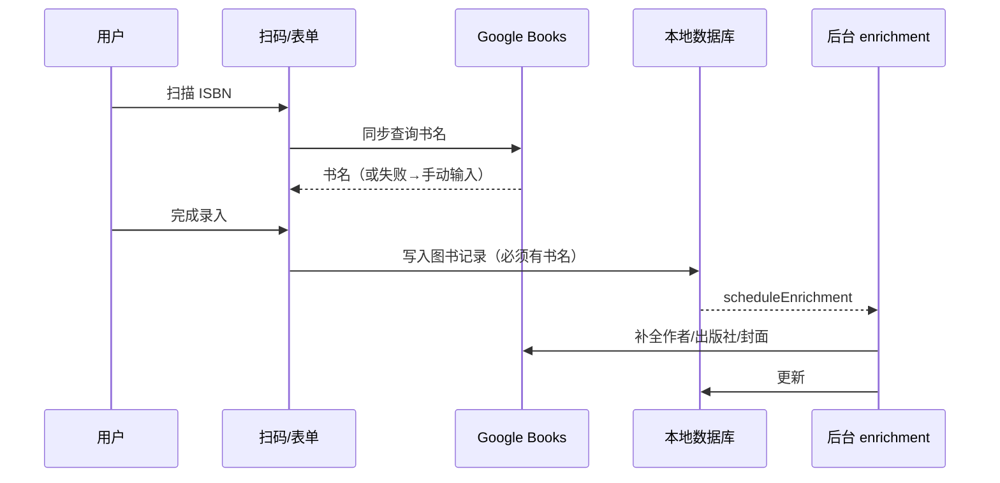
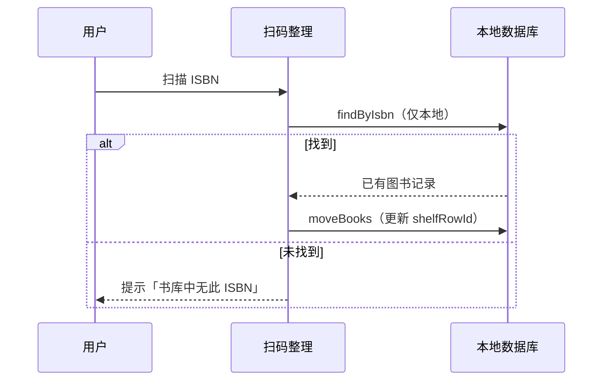

# 家庭图书馆 — 需求与实现说明

> 数据库版本 v4 · 最后更新 2026-08-03

## 一、ISBN 与书目信息拉取策略

### 规则

| 字段 | 拉取时机 | 说明 |
|------|----------|------|
| **书名** | **同步（前台）** | 扫码录入、待购扫码、手动表单扫 ISBN 时必须先查到书名 |
| 作者、出版社、页数、简介 | 后台 | 保存图书后 `scheduleEnrichment()` 补全 |
| 封面缩略图 | 后台 | 保存后异步下载，不阻塞操作 |

### 无书名时的行为

- **扫码录入**：列表标记「未找到书名」，可点编辑手动填写；**无有效书名不能点「完成录入」**
- **手动录入**：保存按钮要求书名非空；扫 ISBN 查不到书名时提示手动填写
- **批量文本**：仅 ISBN 的行会同步查书名；查不到则跳过并计入失败
- **待购扫码**：查不到书名时弹窗手动输入后保存
- **批量录入结果**：扫码/文本批量完成后弹出汇总（成功本数 + 失败明细与原因）

### 后台 enrichment（`BookRepository.enrichBookFromIsbn`）

- **不再修改书名**（已入库的书名视为用户确认结果）
- 仅补全：作者、出版社、页数、简介、封面
- `coverSource=custom` 时不覆盖封面

---

## 二、添加图书 vs 移动图书

### 添加（扫码录入 / 手动 / 批量）



### 移动（扫码整理 / 多选移动 / 详情页移动）



### 核心差异

| 维度 | 添加 | 移动 |
|------|------|------|
| 数据来源 | 网络查书名 + 本地写库 | **仅本地** `findByIsbn` |
| 网络 | 书名阶段需要 | **不需要** |
| 未入库 ISBN | 走添加流程 | 提示未找到 |
| 速度 | 受书名 API 影响 | 毫秒级 |

**结论：移动优先且仅使用本地库；不会为移动去拉取网络信息。**

---

## 三、体验优化（高优先级）

### 记住上次书架/排

- DataStore 保存 `last_bookshelf_id` + `last_row_id`
- 打开书架 Tab 自动恢复上次位置

### 扫码录入重复检测

- 扫到已在库的 ISBN：列表标为「已在库」，显示当前位置
- 已在当前排：单独提示
- 重复项不计入「可保存」数量，保存时自动跳过

### 扫码整理会话汇总

- 返回或系统返回键时，若本次有扫描记录，弹出汇总：
  - 成功移入 N 本
  - 已在目标位 M 本
  - 未入库 K 本

### 空排直达扫码

- 空排中央主按钮：「扫码录入」（归档区为「扫码整理」）

---

## 四、书架显示模式

### 书脊模式（默认）

- 横向排列，模拟一排书架
- **竖排文字**：字符自上而下、列从右到左（非简单旋转横排）
- 书脊宽度随书名长度变化（28–52dp）
- 颜色：有作者时按作者 hash，否则按 bookId
- 底部层板装饰条

### 封面模式

- 网格显示封面缩略图 + 书名
- 偏好保存在 DataStore，重启保持

---

## 四、待购书单 ISBN 扫码

- 待购页 FAB：**扫码加入** / 手动添加
- 路由：`wishlist_scan`
- 流程：扫 ISBN → 同步查书名 → 自动写入待购（含 isbn 字段）
- 已在待购：提示不重复添加
- 书店/图书馆场景：连续扫码即可

---

## 五、扫码反馈

- 识别 ISBN：触觉 CONFIRM
- 整理成功 / 待购加入成功：CONTEXT_CLICK
- 未找到 / 失败：REJECT

---

## 六、单元测试

运行：

```bash
./gradlew test
```

覆盖：

- `BookTitleRules` — 书名有效性
- `CoverService` — ISBN 规范化与校验
- `parseBatchLine` — 批量行解析（含仅 ISBN）
- `normalizeBarcodeToIsbn` — 条码转 ISBN
- `spineWidthDp` — 书脊宽度
- `ArchiveConfig` — 归档书架识别

---

## 七、数据库迁移

| 版本 | 变更 |
|------|------|
| v2 | book.isbn |
| v3 | coverSource, coverStatus |
| v4 | wishlist_item.isbn |

备份 ZIP：`manifest.json` + `data.json` + `covers/*.jpg`

---

## 八、权限与角色

- 普通用户：查找、浏览、阅读、待购（含扫码待购）
- 管理员：书架 CRUD、录入、移动、封面管理、PIN 修改

默认 PIN：`1234`，10 分钟无操作退出。
